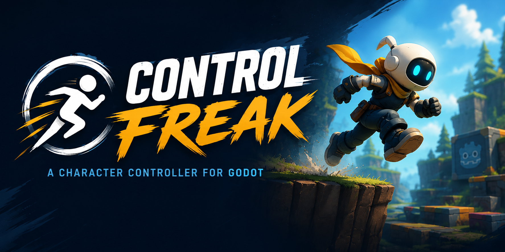

# Control Freak (WIP)

> ⚠ This addon is still a work in progress and is missing a lot of critical features.

<!-- The following text is an initial draft written by Chat-GPT and should be revised by a human.
It is intended only as a starting point for the README. -->

Control Freak is a modular character controller framework for Godot,
designed to provide a flexible foundation for building responsive and highly customizable character movement
systems.

The framework is built around composable component nodes and a state machine architecture.
This allows movement behaviors to be assembled, configured, replaced, and extended without tying the
controller to a single character type or gameplay paradigm.
Whether you are building a platformer, top-down RPG, action game, or something more specialized,
Control Freak is designed to adapt to your needs rather than dictate how your characters should behave.

Control Freak also handles common controller concerns such as input buffering,
allowing actions to remain responsive even when input and execution do not occur on exactly the same frame.
Its architecture is intentionally extensible, making it possible to add custom movement behaviors and states
while reusing the framework's existing components and systems.

Out of the box, Control Freak provides ready-to-use functionality for 2D platformer and side-scroller
controls, 2D top-down controls, 3D character movement, wall climbing, jumping, and more.
These features serve both as practical building blocks and as examples of how the framework can be composed
and extended.

Control Freak's goal is not to provide a single "correct" character controller, but to give developers the tools to build the controller their game actually needs.


## Installation

### Via Git

```
git submodule add $repository_clone_uri addons/ControlFreak
```

> Replace `$repository_clone_uri` with the URL of the Control Freak repository.
